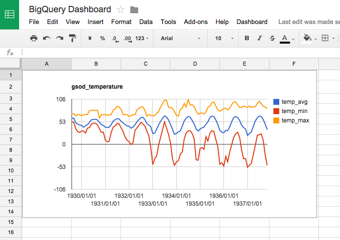
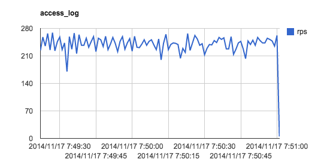

# Fluentd + Google BigQuery Getting Started Sample

This sample explains how to set up a [Fluentd](http://www.fluentd.org/) + [Google BigQuery](https://cloud.google.com/bigquery/) integration in a [Docker](https://www.docker.com/) container that sends [nginx](http://nginx.org/en/) web server access log to the BigQuery in real time with [fluent-plugin-bigquery](https://github.com/kaizenplatform/fluent-plugin-bigquery). The whole process may take only 20 - 30 minutes with the following steps:

- Sign Up for Google Cloud Platform and BigQuery Service
- Creating a dataset and table on Google BigQuery
- Run nginx + Fluentd on Google Compute Engine (GCE) in a Docker container
- Execute BigQuery query
- (Optional) Using BigQuery Dashboard built with Google Sheets

The logs collected by Fluentd can be aggregated by BigQuery, and visualized by [BigQuery Dashboard](bigquery-dashboard-howto.md) easily:



## Sign Up for Google Cloud Platform

(You can skip this section if you have done before)

- If you don't already have one, sign up for a [Google account](https://accounts.google.com/SignUp).
- Go to the [Google Developers Console](https://console.developers.google.com/?_ga=1.200477227.420342054.1415120486).
- Select your target project. If you want to create a new project, click on Create Project.
- BigQuery is automatically enabled in new projects. To activate BigQuery in a pre-existing project, click APIS & AUTH in the left navigation, then click APIs. Navigate to BigQuery API. If the status indicator says OFF, click the indicator once to switch it to ON.
- Set up billing. BigQuery offers a free tier for queries, but other operations require billing to be set up before you can use the service.
- Open [BigQuery Browser Tool](https://console.developers.google.com/)
- Click `COMPOSE QUERY` button at top left and execute the following sample query with the tool to check you can access BigQuery.

```
SELECT title FROM [publicdata:samples.wikipedia] WHERE REGEXP_MATCH(title, r'.*Query.*') LIMIT 100
```

## Creating a dataset and table on Google BigQuery

To create a dataset and table, you need to install `bq` command tool included in Cloud SDK. 

- Download and install the [Cloud SDK](https://cloud.google.com/sdk/).
- Authenticate your client by running:

```
$ gcloud auth login
```

- Set the project you are working on with the project ID noted earlier

```
$ gcloud config set project <YOUR PROJECT ID>
```

- Create a dataset `bq-test` by executing the following command:

```
$ bq mk bq_test
```

- `cd` into the directory for this repository if you are not already.

```
cd bigquery-fluentd-docker-sample
```

- Execute the following command to create the table `access_log`.

```
$ bq mk -t bq_test.access_log ./schema.json
```

- Reload the BigQuery Browser Tool page, select your project, `bq_test` dataset and `access_log` table. Confirm that the table has been created with the specified schema correctly.

## Creating a Google Compute Engine instance

- Run the following command to create a GCE instance named `bq-test`. This will take around 30 secs.

For more information about the features of GCE instances and their features,
see the [product documentation](https://cloud.google.com/compute/docs/instances)

```
$ gcloud compute instances create "bq-test" \
--zone "us-central1-a"  \
--machine-type "n1-standard-1"  \
--network "default" \
--maintenance-policy "MIGRATE"  \
--scopes storage-ro bigquery \
--image container-vm-v20140929 \
--image-project google-containers
```

## Run nginx + Fluentd with Docker container

- Enter the following command to log in to the GCE instance.

``` 
$ gcloud compute ssh bq-test --zone=us-central1-a
```

- In the GCE instance, run the following command (replace `YOUR_PROJECT_ID` with your project id). This will start downloading a Docker image `kazunori279/fluentd-bigquery-sample` which contains nginx web server with Fluentd.

```
$ sudo docker run -e GCP_PROJECT="YOUR_PROJECT_ID" -p 80:80 -t -i -d kazunori279/fluentd-bigquery-sample
```

This will launch a run a docker container preconfigured with nginx and fluentd,
this docker container is described in more detail below. We now want to
generate some page views so that we can verify that fluentd is sending data to
BigQuery.

- Open [Google Developers Console](https://console.developers.google.com/project) on a browser, choose your project and select `Compute` - `Compute Engine` - `VM instances`.

- Find `bq-test` GCE instance and click it's external IP link. On the dialog, select `Allow HTTP traffic` and click `Apply` to add the firewall rule. There will be an Activities dialog shown in the bottom right of the window with a message `Updating instance tags for "bq-test"`.

- After updating instance tags, click the external IP link again to direct your browser to hit the nginx server on the instance. It will show a blank web page titled "Welcome to nginx!". Click reload button several times.


## Execute BigQuery query

- Open BigQuery Browser Tool, click `COMPOSE QUERY` and execute the following query. You will see the requests from browser are recorded on access_log table (it may take a few minutes to receive the very first log entries from fluentd).

```
SELECT * FROM [bq_test.access_log] LIMIT 1000
```

That's it! You've just confirmed that nginx access log events are collected by Fluentd, imported into BigQuery and visible in the Browser Tool. You may use Apache Bench tool or etc to hit the web page with more traffic to see how Fluentd + BigQuery can handle high volume logs in real time. It can support up to 10K rows/sec by default (and you can extend it to 100K rows/sec by requesting).

## Using BigQuery Dashboard

Using Google Sheets and the BigQuery connector, you can create a [BigQuery Dashboard](bigquery-dashboard-howto.md) which lets you easily write and visualize queries periodically (e.g. every minute, hour, or day). See [BigQuery Dashboard How-To](bigquery-dashboard-howto.md) to learn how to set this up.

- Follow the steps described in [BigQuery Dashboard How-To](bigquery-dashboard-howto.md) to set up a dashboard, including the automatic query execution section.

- Add the following query on `BQ Queries` sheet with a query name `access_log_LINE` and interval `1` min.

```
SELECT
  STRFTIME_UTC_USEC(time * 1000000, "%Y-%m-%d %H:%M:%S") as tstamp, 
  count(*) as rps
FROM bq_test.access_log
GROUP BY tstamp ORDER BY tstamp DESC;
```

- (assuming you are using Mac OS or Linux) Open a local terminal and execute the following command to execute Apache Bench to hit the nginx with high traffic. Replace `YOUR_EXTERNAL_IP` with the external IP of the GCE instance.

```
ab -c 100 -n 1000000 http://YOUR_EXTERNAL_IP/
```

- Open the `BigQuery Dashboard` and select `Dashboard` - `Run All BQ Queries` on the menu. You will see a graph `access_log` is drawn on the dashboard. This graph will be refreshed every one minute.



- Stop the Apache Bench command by pressing `Ctrl+C`.

## Inside Dockerfile and td-agent.conf

If you take a look at the [Dockerfile](Dockerfile), you can learn how the Docker container has been configured. After preparing an Ubuntu image, it installs Fluentd, nginx and the [fluent-plugin-bigquery](https://github.com/kaizenplatform/fluent-plugin-bigquery).

```
FROM ubuntu:12.04
MAINTAINER kazunori279-at-gmail.com

# environment
ENV DEBIAN_FRONTEND noninteractive
RUN echo "deb http://archive.ubuntu.com/ubuntu precise main universe" > /etc/apt/sources.list

# update, curl, sudo
RUN apt-get update && apt-get -y upgrade
RUN apt-get -y install curl 
RUN apt-get install sudo

# fluentd
RUN curl -O http://packages.treasure-data.com/debian/RPM-GPG-KEY-td-agent && apt-key add RPM-GPG-KEY-td-agent && rm RPM-GPG-KEY-td-agent
RUN curl -L http://toolbelt.treasuredata.com/sh/install-ubuntu-precise-td-agent2.sh | sh 
ADD td-agent.conf /etc/td-agent/td-agent.conf

# nginx
RUN apt-get install -y nginx
ADD nginx.conf /etc/nginx/nginx.conf

# fluent-plugin-bigquery
RUN /usr/sbin/td-agent-gem install fluent-plugin-bigquery --no-ri --no-rdoc -V

# start fluentd and nginx
EXPOSE 80
ENTRYPOINT /etc/init.d/td-agent restart && /etc/init.d/nginx start && /bin/bash
```

In the [td-agent.conf](td-agent.conf) file, you can see how to configure it to forward Fluentd logs to fluent-plugin-bigquery. It's as simple as the following:

```
<match nginx.access>
  type bigquery
  auth_method compute_engine

  project "#{ENV['GCP_PROJECT']}"
  dataset bq_test
  tables access_log

  time_format %s
  time_field time
  fetch_schema true
  field_integer time
</match>
```

Since you are running the GCE instance within the same GCP project of BigQuery dataset, you don't have to copy any private key file to the GCE instance for OAuth2 authentication. ` "#{ENV['GCP_PROJECT']}"` refers to your project id passed through the environment variable you gave as an argument when starting the docker container.

You can also use fluentd to send data from compute instances running outside of
the project, or outside of GCE entirely. To authorize the fluentd BigQuery plugin, you will need the
private key and email for a Google API [Service Account](https://developers.google.com/accounts/docs/OAuth2ServiceAccount).

- Go to your project in the Developer Console and open the Credentials section
  of APIs & auth project console.
- Choose to "Create new Client ID" and choose "Service Account"
- Download the install the private key with fluentd on the host, and use the
  account email in the [fluentd plugin settings](https://github.com/kaizenplatform/fluent-plugin-bigquery#authentication).
- Note that this service account has access to the resources of the project, so
  it should only be distributed on trusted machines.

## Cleaning Up

- Execute the following command to delete GCE instance.

```
gcloud compute instances delete bq-test --zone=us-central1-a
```

- On BigQuery Browser Tool, click the drop down menu of `bq_test` dataset and select `Delete dataset`

## License

* See [LICENSE](LICENSE)
