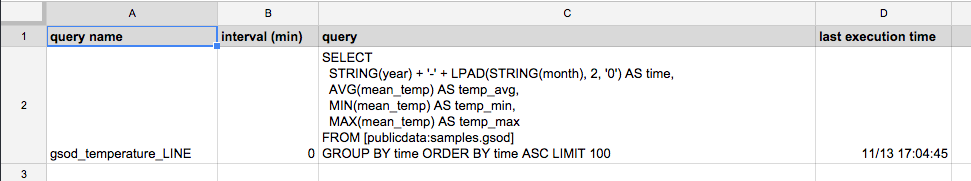

# BigQuery Dashboard How-To

BigQuery Dashboard is a Google Spreadsheet that can execute [Google BigQuery](https://cloud.google.com/bigquery/) queries and charts the result every minute/hour. 

## Features

- The dashboard is a **Google Spreadsheet**: hosted for free by [Google Sheets](http://www.google.com/sheets/about/)
- It is easy to customize and integrate with your business process even non-programmers. 
- It is just a matter of copying the spreadsheet, click some buttons as described in Getting Started, and then it's ready to use.

- Easy **Big Data** analytics with BigQuery: you can execute BigQuery query just by entering a SQL on a sheet. The Dashboard will automatically execute it every minute/hour and draw a chart from the result. 
  

## Getting Started

To start using BigQuery Dashboard, follow the instruction below.

1. Open [this spreadsheet](https://docs.google.com/spreadsheets/d/1Xwk2icyXH2DmVIZC33SAs5bs012ZIt0-goyX0dZZu7s/edit) and select `File` - `Make a copy` menu to make a copy of it
1. Copy the URL of the copied spreadsheet to clipboard
1. Select `Tools` - `Script editor...` menu
1. On the Script editor, open `bq_query.gs`. Paste the copied URL on the place of `<<PLEASE PUT YOUR SPREADSHEET URL HERE>>`. Select `File` - `Save` menu to save the file
1. Paste Project ID of your Google Cloud Platform project on the place of `<<PLEASE PUT YOUR PROJECT ID HERE>>`. Select `File` - `Save` menu to save the file
1. Select `Resources` - `Advanced Google services` menu and turn on `BigQuery API`
1. Click `Google Developers Console` link on the dialog. This will show a list of APIs. Find `BigQuery API` and toggle permissions widget from `OFF` to `ON` to enable access. You will see `BigQuery API` on the `Enabled APIs` list on the top of the page
1. Close the Console, click `OK` button in the dialog

### Execute a sample query:

Now it's ready to execute BigQuery queries from the spreadsheet. Use the following instructions to try executing a sample query.

1. Open the spreadsheet and open `BQ Queries` sheet. The sheet has a sample BQ query named `gsod_temparature_LINE` which aggregates temparature data of each year from the public GSOD dataset available on BigQuery
2. Select `Dashboard` - `Run All BQ Queries` menu. For the first time, it will show a dialog `Authorization Required`. Click `Continue` button and then `Accept` button
3. There will be a `gsod_template` sheet added. Open the sheet and check there are the query results
4. Open the `Lambda Dashboard` sheet and check there is a graph added for the query results

### Automatic query execution:

If you like to execute the queries periodically, use the following instructions.

1. Open the Script editor and select `Resources` - `Current project's triggers`
2. Click `Click here to add one now`
3. Select `runQueries` for `Run` menu, and select `Time-driven` `Minutes timer` `Every minute` for `Events`, and click `Save`
4. Go back to `BQ Queries` sheet, set `1` to the `interval (min)` column of the `gsod_temperature_LINE` query

By this setting, the sample query will be executed every one minute. Set `0` to the `interval (min)` to disable the periodical execution.

### Notes:

- When the spreadsheet executes a query with a new query name, it creates a new sheet with the query name
- If the query name has a suffix `_AREA`, `_BAR`, `_COLUMN`, `_LINE`, `_SCATTER`, or `_TABLE`, it will also create a new sheet with a specified chart
- If the query name has a suffix `_AREA_STACKED`, `_BAR_STACKED` or `_COLUMN_STACKED`, it will create a stacked chart
- Put `LIMIT 100` at the end of each query to limit the lines of query result to 100. Otherwise it may throw an error when the results exceed the limit
- The first field of the query results should be timestamp or date value to draw a chart with chronological order
